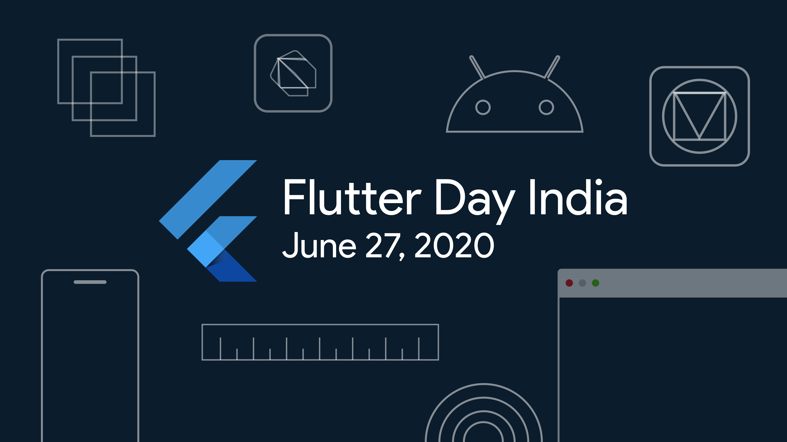

# Flutter Day India

 
 

<a href="#getting-started">:rocket:Get Started</a>

## Overview
Flutter Day India is an online event driven by Indian Flutter Communities to gather all Flutter passionate people and learn to create beautiful apps! Our goal is to share Flutter knowledge, improve Flutter skills, and expand the Flutter community. 
It is made for Flutter India Community which will show all the updates about Flutter India Community.
This is the repository of Flutter India Community.

### What is Flutter India
Flutter India is an initiative of all the communities in India. 
The communities present under Flutter India are as follows:
1. <a href="https://www.meetup.com/Mumbai-Flutter/">Flutter Mumbai Community</a>
2. <a href="https://www.meetup.com/FlutterAHM/">Flutter Ahemdabad</a>
3. <a href="https://www.meetup.com/FlutterSurat/">Flutter Surat</a>
4. <a href="https://www.meetup.com/Flutter-Pune-Development-Meetup/">Flutter Pune</a>
5. <a href="https://www.meetup.com/Gwalior-Flutter-Meetup-Group/">Flutter Gwalior</a>
6. <a href="https://www.meetup.com/flutter-bangalore-group/">Flutter Bangalore</a>
7. <a href="https://twitter.com/fluttervadodara">Flutter Vadodara</a>
8. <a href="https://www.meetup.com/flutterngp/">Flutter Nagpur</a>
9. <a href="https://www.meetup.com/Flutter-Hyderabad/">Flutter Hyderabad</a>
10. <a href="https://twitter.com/flutterkerala/">Flutter Kerala</a>

## Technology Stack

- Flutter
- Firebase

